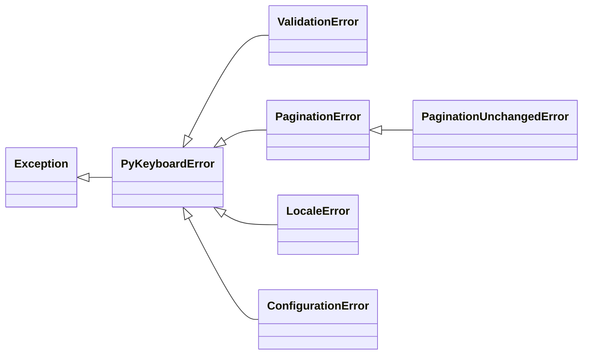

# Errors

All error classes are importable from `pykeyboard`.

## Hierarchy



---

## PyKeyboardError <span class="api-badge class">Base</span>

Base class for all PyKeyboard errors. Catch this to handle any library error.

```python
PyKeyboardError(
    message: str,
    error_code: str = "PYKEYBOARD_ERROR",
    param: str = "",
    value: Any = None,
    reason: str = "",
)
```

### Common Attributes

| Attribute | Type | Description |
|-----------|------|-------------|
| `error_code` | `str` | Stable identifier, e.g. `"VALIDATION_ERROR"` |
| `message` | `str` | Human-readable description |
| `param` | `str` | Parameter that caused the error |
| `value` | `Any` | The invalid value |
| `reason` | `str` | Additional context |

!!! tip
    Use `error_code` for programmatic handling. Use `str(e)` for user-facing messages — it returns a clean, multi-line formatted string.

---

## ValidationError <span class="api-badge class">Class</span>

Raised when button or keyboard input fails validation.

**Error code:** `VALIDATION_ERROR`

```python
ValidationError(param: str, value: Any, reason: str = "")
```

??? example
    ```python
    from pykeyboard.keyboard_base import Button

    try:
        Button(text="")
    except ValidationError as e:
        print(e.error_code)  # "VALIDATION_ERROR"
        print(e.param)       # "text"
    ```

---

## PaginationError <span class="api-badge class">Class</span>

Raised when pagination parameters are invalid.

**Error code:** `PAGINATION_ERROR`

```python
PaginationError(param: str, value: Any, reason: str = "")
```

??? example
    ```python
    from pykeyboard import InlineKeyboard, PaginationError

    try:
        InlineKeyboard().paginate(0, 1, "page:{number}")
    except PaginationError as e:
        print(e.param)  # "count_pages"
        print(e.value)  # 0
    ```

---

## PaginationUnchangedError <span class="api-badge class">Class</span>

Raised when an identical pagination keyboard was already generated (duplicate prevention).

**Error code:** `PAGINATION_UNCHANGED`
**Inherits:** `PaginationError`

??? example
    ```python
    from pykeyboard import PaginationUnchangedError

    try:
        kb.paginate(5, 3, "page:{number}")
    except PaginationUnchangedError:
        await callback.answer("Already on this page")
    ```

---

## LocaleError <span class="api-badge class">Class</span>

Raised when locale parameters are invalid.

**Error code:** `LOCALE_ERROR`

```python
LocaleError(param: str, value: Any, reason: str = "")
```

---

## ConfigurationError <span class="api-badge class">Class</span>

Raised when keyboard configuration is invalid.

**Error code:** `CONFIGURATION_ERROR`

```python
ConfigurationError(param: str, value: Any, reason: str = "")
```

??? example
    ```python
    from pykeyboard import InlineKeyboard, ConfigurationError

    try:
        InlineKeyboard(row_width=0)
    except ConfigurationError as e:
        print(e.param)  # "row_width"
        print(e.value)  # 0
    ```
