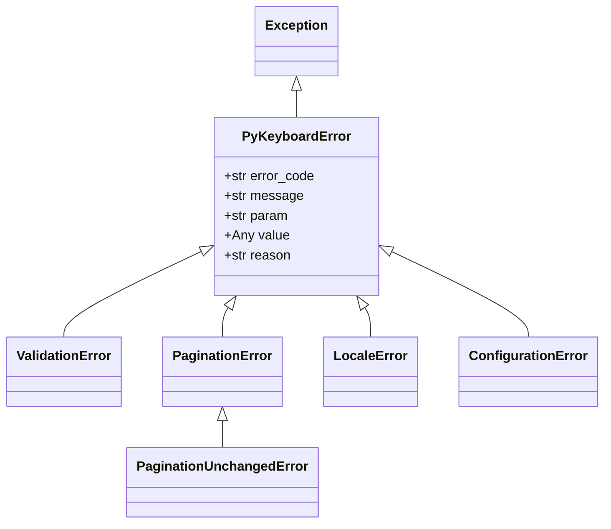

# Error Handling

PyKeyboard uses a hierarchy of structured error classes that carry context about what went wrong.

## Error Hierarchy



All errors inherit from `PyKeyboardError`, so you can catch them all at once or handle each type individually.

## Common Attributes

Every `PyKeyboardError` carries:

| Attribute    | Type  | Description                                  |
| ------------ | ----- | -------------------------------------------- |
| `error_code` | `str` | Unique identifier, e.g. `"VALIDATION_ERROR"` |
| `message`    | `str` | Human-readable description                   |
| `param`      | `str` | Name of the parameter that caused the error  |
| `value`      | `Any` | The invalid value that was passed            |
| `reason`     | `str` | Additional context about why it failed       |

## Error Types

### ValidationError

Raised when a button or keyboard input fails validation.

```python
from pykeyboard.keyboard_base import Button

try:
    Button(text="")  # Empty text is invalid
except ValidationError as e:
    print(e.error_code)  # "VALIDATION_ERROR"
    print(e.param)       # "text"
```

### PaginationError

Raised when pagination parameters are invalid.

```python
from pykeyboard import InlineKeyboard, PaginationError

try:
    kb = InlineKeyboard()
    kb.paginate(0, 1, "page:{number}")  # total_pages must be >= 1
except PaginationError as e:
    print(e.error_code)  # "PAGINATION_ERROR"
```

### PaginationUnchangedError

A subclass of `PaginationError`, raised when the same pagination keyboard would be regenerated (duplicate prevention).

```python
from pykeyboard import InlineKeyboard, PaginationUnchangedError

kb = InlineKeyboard()
kb.paginate(5, 3, "page:{number}")

try:
    kb.paginate(5, 3, "page:{number}")  # Same parameters — duplicate
except PaginationUnchangedError:
    print("Keyboard unchanged — skip the edit")
```

### LocaleError

Raised when locale parameters are invalid.

```python
from pykeyboard import InlineKeyboard, LocaleError

try:
    kb = InlineKeyboard()
    kb.languages("invalid_pattern", ["en_US"])  # Missing {locale} placeholder
except LocaleError as e:
    print(e.error_code)  # "LOCALE_ERROR"
```

### ConfigurationError

Raised when keyboard configuration is invalid.

```python
from pykeyboard import InlineKeyboard, ConfigurationError

try:
    kb = InlineKeyboard(row_width=0)  # Must be >= 1
except ConfigurationError as e:
    print(e.error_code)  # "CONFIGURATION_ERROR"
    print(e.param)       # "row_width"
    print(e.value)       # 0
```

## Catching All Errors

```python
from pykeyboard import PyKeyboardError

try:
    # Any keyboard operation
    ...
except PyKeyboardError as e:
    print(f"[{e.error_code}] {e.message}")
    if e.param:
        print(f"  Parameter: {e.param} = {e.value}")
    if e.reason:
        print(f"  Reason: {e.reason}")
```

## Best Practices

1. **Catch specific errors** when you need different recovery logic:

   ```python
   except PaginationUnchangedError:
       await callback.answer("Already on this page")
   except PaginationError as e:
       logger.error(f"Pagination error: {e}")
   ```

2. **Catch `PyKeyboardError`** as a fallback for unexpected library errors.

3. **Use `error_code`** for programmatic handling and logging — it's stable across versions.

4. **Use `str(e)`** for user-facing messages — it returns a clean, formatted string.
