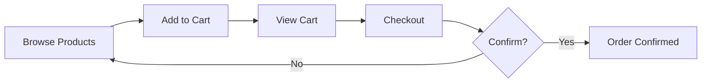

# E-commerce Bot Example

A product catalog bot with shopping cart, pagination, and checkout using `KeyboardFactory`.

!!! tip "Tested Reference"
For a fully tested, comprehensive example, see the [Showcase Bot](showcase-bot.md).

## Overview

This example shows:

- Product catalog with pagination
- Shopping cart management (add/remove items)
- Checkout with `KeyboardFactory.create_confirmation_keyboard()`
- Error handling with `PyKeyboardError`

## Code

```python
from pyrogram import Client, filters
from pykeyboard import (
    InlineKeyboard,
    InlineButton,
    KeyboardFactory,
    PyKeyboardError,
    PaginationUnchangedError,
)

app = Client("ecommerce_bot")

# Mock product data
PRODUCTS = [
    {"id": 1, "name": "Wireless Headphones", "price": 99.99, "category": "Electronics"},
    {"id": 2, "name": "Smart Watch", "price": 199.99, "category": "Electronics"},
    {"id": 3, "name": "Coffee Maker", "price": 79.99, "category": "Appliances"},
    {"id": 4, "name": "Running Shoes", "price": 129.99, "category": "Sports"},
    {"id": 5, "name": "Yoga Mat", "price": 39.99, "category": "Sports"},
    {"id": 6, "name": "Cookbook", "price": 24.99, "category": "Books"},
]

PER_PAGE = 3

# User cart storage (in production, use a database)
user_carts: dict[int, list[dict]] = {}


def get_products_page(page: int) -> list[dict]:
    """Get products for a specific page."""
    start = (page - 1) * PER_PAGE
    return PRODUCTS[start : start + PER_PAGE]


def total_pages() -> int:
    return (len(PRODUCTS) + PER_PAGE - 1) // PER_PAGE


def create_product_keyboard(products: list[dict], current_page: int) -> InlineKeyboard:
    """Create keyboard for product listing with pagination."""
    keyboard = InlineKeyboard()

    for product in products:
        keyboard.row(
            InlineButton(
                f"{product['name']} - ${product['price']}",
                callback_data=f"product:{product['id']}",
            ),
            InlineButton("🛒 Add", callback_data=f"add_cart:{product['id']}"),
        )

    # Add pagination if needed
    pages = total_pages()
    if pages > 1:
        try:
            keyboard.paginate(pages, current_page, "page:{number}")
        except PaginationUnchangedError:
            pass  # Same page — skip

    # Cart and categories row
    keyboard.row(
        InlineButton("🛒 View Cart", callback_data="view_cart"),
        InlineButton("📂 Categories", callback_data="categories"),
    )

    return keyboard


def create_cart_keyboard(cart_items: list[dict]) -> InlineKeyboard:
    """Create keyboard for cart management."""
    keyboard = InlineKeyboard()

    if not cart_items:
        keyboard.add(InlineButton("🛍️ Continue Shopping", callback_data="page:1"))
        return keyboard

    total = sum(item["price"] * item["quantity"] for item in cart_items)

    for item in cart_items:
        subtotal = item["price"] * item["quantity"]
        keyboard.row(
            InlineButton(
                f"{item['name']} x{item['quantity']} — ${subtotal:.2f}",
                callback_data=f"cart_item:{item['id']}",
            ),
            InlineButton("➕", callback_data=f"cart_add:{item['id']}"),
            InlineButton("➖", callback_data=f"cart_remove:{item['id']}"),
        )

    keyboard.row(InlineButton(f"💰 Total: ${total:.2f}", callback_data="noop"))
    keyboard.row(
        InlineButton("✅ Checkout", callback_data="checkout"),
        InlineButton("🛍️ Shop", callback_data="page:1"),
        InlineButton("🗑️ Clear", callback_data="clear_cart"),
    )

    return keyboard


@app.on_message(filters.command("start"))
async def start_command(client, message):
    user_carts[message.from_user.id] = []
    products = get_products_page(1)
    keyboard = create_product_keyboard(products, 1)

    await message.reply_text(
        "🛍️ **Welcome to our Store!**\n\n"
        "Browse our products and add them to your cart:",
        reply_markup=keyboard,
    )


@app.on_callback_query(filters.regex(r"^page:"))
async def handle_pagination(client, callback_query):
    page = int(callback_query.data.split(":")[1])
    products = get_products_page(page)
    pages = total_pages()

    try:
        keyboard = create_product_keyboard(products, page)
        await callback_query.edit_message_text(
            f"🛍️ **Products (Page {page}/{pages})**\n\n"
            "Browse our products:",
            reply_markup=keyboard,
        )
    except PyKeyboardError as e:
        await callback_query.answer(f"Error: {e.error_code}")

    await callback_query.answer()


@app.on_callback_query(filters.regex(r"^add_cart:"))
async def handle_add_to_cart(client, callback_query):
    user_id = callback_query.from_user.id
    product_id = int(callback_query.data.split(":")[1])

    if user_id not in user_carts:
        user_carts[user_id] = []

    product = next((p for p in PRODUCTS if p["id"] == product_id), None)
    if product:
        cart_item = next(
            (item for item in user_carts[user_id] if item["id"] == product_id),
            None,
        )
        if cart_item:
            cart_item["quantity"] += 1
        else:
            user_carts[user_id].append({**product, "quantity": 1})

        await callback_query.answer(f"✅ {product['name']} added to cart!")


@app.on_callback_query(filters.regex(r"^view_cart$"))
async def handle_view_cart(client, callback_query):
    user_id = callback_query.from_user.id
    cart_items = user_carts.get(user_id, [])
    keyboard = create_cart_keyboard(cart_items)

    if not cart_items:
        text = "🛒 **Your Cart**\n\nYour cart is empty."
    else:
        lines = [f"• {item['name']} x{item['quantity']} — "
                 f"${item['price'] * item['quantity']:.2f}"
                 for item in cart_items]
        total = sum(item["price"] * item["quantity"] for item in cart_items)
        text = "🛒 **Your Cart**\n\n" + "\n".join(lines) + f"\n\n**Total: ${total:.2f}**"

    await callback_query.edit_message_text(text, reply_markup=keyboard)
    await callback_query.answer()


@app.on_callback_query(filters.regex(r"^checkout$"))
async def handle_checkout(client, callback_query):
    user_id = callback_query.from_user.id
    cart_items = user_carts.get(user_id, [])

    if not cart_items:
        await callback_query.answer("Your cart is empty!")
        return

    total = sum(item["price"] * item["quantity"] for item in cart_items)

    # Use KeyboardFactory for confirmation dialog
    keyboard = KeyboardFactory.create_confirmation_keyboard(
        yes_text="✅ Confirm Order",
        no_text="❌ Cancel",
        callback_pattern="order_{action}",
    )

    lines = [f"• {item['name']} x{item['quantity']} — "
             f"${item['price'] * item['quantity']:.2f}"
             for item in cart_items]
    summary = "📋 **Order Summary**\n\n" + "\n".join(lines)
    summary += f"\n\n**Total: ${total:.2f}**\n\nConfirm your order?"

    await callback_query.edit_message_text(summary, reply_markup=keyboard)
    await callback_query.answer()


@app.on_callback_query(filters.regex(r"^order_"))
async def handle_order_confirmation(client, callback_query):
    action = callback_query.data.split("_")[1]
    user_id = callback_query.from_user.id

    if action == "yes":
        cart_items = user_carts.get(user_id, [])
        total = sum(item["price"] * item["quantity"] for item in cart_items)
        user_carts[user_id] = []

        back_kb = InlineKeyboard()
        back_kb.add(InlineButton("🛍️ Continue Shopping", callback_data="page:1"))

        await callback_query.edit_message_text(
            f"✅ **Order Confirmed!**\n\n"
            f"Total: ${total:.2f}\n\n"
            "You will receive a confirmation email shortly.",
            reply_markup=back_kb,
        )
    else:
        keyboard = create_product_keyboard(get_products_page(1), 1)
        await callback_query.edit_message_text(
            "❌ Order cancelled.\n\nYou can continue shopping:",
            reply_markup=keyboard,
        )

    await callback_query.answer()


if __name__ == "__main__":
    app.run()
```

## E-commerce Flow



## Features Demonstrated

- Product catalog with `paginate()` and `PaginationUnchangedError` handling
- Shopping cart with add/remove buttons per item
- `KeyboardFactory.create_confirmation_keyboard()` for checkout
- Error handling with `PyKeyboardError`

## Running

```bash
pip install pykeyboard-kurigram
export TELEGRAM_BOT_TOKEN="..."
export TELEGRAM_API_ID="..."
export TELEGRAM_API_HASH="..."
python ecommerce_bot.py
```

Send `/start` to begin shopping.
