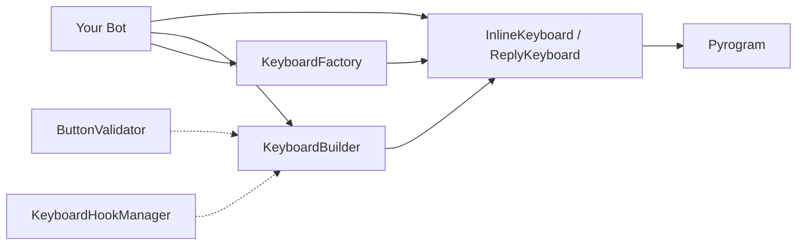

# <span class="hero-title">PyKeyboard</span>

<div align="center" markdown>
<p align="center">

</p>

**Modern, Type-Safe Keyboard Library for Kurigram**

[:material-download: Install](installation.md){ .md-button .md-button--primary }
[:material-rocket-launch: Quick Start](quickstart.md){ .md-button }
[:fontawesome-brands-github: GitHub](https://github.com/johnnie-610/pykeyboard){ .md-button }

</div>

---

## Features

<div class="grid cards" markdown>

- :material-earth:{ .lg .middle } **50+ Languages**

  ***

  Comprehensive locale support with native names and flag emojis

- :material-page-previous-outline:{ .lg .middle } **Smart Pagination**

  ***

  Automatic page navigation with duplicate prevention and LRU caching

- :material-wrench:{ .lg .middle } **Builder & Factory**

  ***

  Fluent `KeyboardBuilder` API and one-line `KeyboardFactory` presets

- :material-hook:{ .lg .middle } **Hooks & Validation**

  ***

  Rule-based button validation and transforms via `ButtonValidator`

- :material-alert-circle-outline:{ .lg .middle } **Structured Errors**

  ***

  Typed error classes with `error_code`, `param`, `value`, and `reason`

- :material-swap-horizontal:{ .lg .middle } **Full Pyrogram Compat**

  ***

  Drop-in `reply_markup=` support with zero adapter code

</div>

---

## Quick Examples

=== "Inline Keyboard"

    ```python
    from pykeyboard import InlineKeyboard, InlineButton

    keyboard = InlineKeyboard()
    keyboard.add(
        InlineButton("👍 Like", "action:like"),
        InlineButton("👎 Dislike", "action:dislike"),
        InlineButton("📊 Stats", "action:stats"),
    )

    await message.reply_text("What do you think?", reply_markup=keyboard)
    ```

=== "Reply Keyboard"

    ```python
    from pykeyboard import ReplyKeyboard, ReplyButton

    keyboard = ReplyKeyboard(resize_keyboard=True, one_time_keyboard=True)
    keyboard.add(
        ReplyButton("Yes"),
        ReplyButton("No"),
        ReplyButton("Maybe"),
    )

    await message.reply_text("Choose:", reply_markup=keyboard)
    ```

=== "Builder Pattern"

    ```python
    from pykeyboard import KeyboardBuilder, InlineKeyboard

    kb = (
        KeyboardBuilder(InlineKeyboard())
        .add_row("✅ Yes", "❌ No")
        .add_row("🤔 Maybe")
        .build()
    )
    ```

=== "Factory"

    ```python
    from pykeyboard import KeyboardFactory

    kb = KeyboardFactory.create_confirmation_keyboard(
        yes_text="✅ Confirm",
        no_text="❌ Cancel",
    )
    ```

---

## Architecture



| Layer       | Components                                                       |
| ----------- | ---------------------------------------------------------------- |
| **Core**    | `InlineKeyboard`, `ReplyKeyboard`, `InlineButton`, `ReplyButton` |
| **Builder** | `KeyboardBuilder` — fluent API with chaining                     |
| **Factory** | `KeyboardFactory` — one-line keyboard presets                    |
| **Hooks**   | `ButtonValidator`, `KeyboardHookManager`                         |
| **Errors**  | `PyKeyboardError` hierarchy with structured data                 |
| **Locale**  | 50+ built-in locales + custom locale registration                |

---

## Community & Support

- :fontawesome-brands-github: **[GitHub Repository](https://github.com/johnnie-610/pykeyboard)** — source code and issues
- :material-forum: **[GitHub Discussions](https://github.com/johnnie-610/pykeyboard/discussions)** — community support
- :material-bug: **[Issue Tracker](https://github.com/johnnie-610/pykeyboard/issues)** — bug reports and feature requests

---

<div align="center" markdown>
**Made with :heart: for the Telegram bot development community**

_MIT License — [View on GitHub](https://github.com/johnnie-610/pykeyboard)_

</div>
